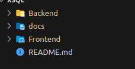
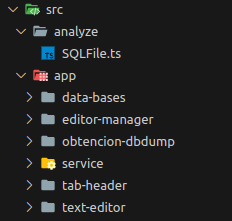
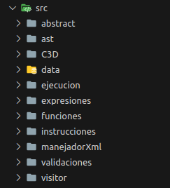

#Manual Tecnico

## Detalles del proyecto

La elección de la arquitectura cliente-servidor para el desarrollo de la aplicación proporciona una estructura organizada y eficiente. El cliente se desarrollo utilizando Angular, lo que implica una interfaz de usuario dinámica y amigable. Por otro lado, el servidor se implementó mediante Python con Flask, aprovechando la versatilidad y capacidad.

Para los aspectos relacionados con el análisis léxico y sintáctico de la aplicación, se utilizó la librería PLY.

## Docs
Contiene la documentación del proyecto, tanto el manual de usuario, técnico y grámatica.

## Cliente

La aplicación Angular se ha organizado cuidadosamente para mejorar la legibilidad, mantenibilidad y escalabilidad del código. La estructura del proyecto sigue las mejores prácticas de Angular y se han definido paquetes específicos para agrupar módulos y componentes relacionados. 

Este enfoque organizado y modular puede facilitar el mantenimiento y la comprensión del código.

A continuación, se presenta la estructura de directorios principal: 

**src/analyze**: Contiene la clase encargada de almacenar un archivo en formato .sql, se almacena tanto el nombre como el contenido para su posterior análisis. 

**app/data-bases**: Contiene el componente que se encarga de mostrar las bases de datos almacenadas y permite ver en una estructura de arbol cada una de las tablas que compone la base de datos.

**app/data-bases/models** Este paquete almacena la lógica necesaria para visualizar las tablas cuando se selecciona una base de datos específica en la estructura de arbol. Este directorio en sí esta dedicado a la manipulación y presentación de datos relacionados con las tablas de la base de datos en el contexto de la aplicación.

**app/editor-manager**: Este componente en cuestion es el encargado de manejar toda la parte de las pestañas junto con su editor de texto correspondiente, la consola de salida, las tablas de simbolos y las tablas de funciones almacenadas en las bases de datos.

**app/obtencion-dbdump**:Este paquete se encarga de gestionar la funcionalidad de dump en la aplicación. Este paquete integra tanto la parte visual como la lógica necesaria para llevar a cabo esta operación.

**app/service** Este direcctorio juega un papel importante en la aplicación al contener la clase encargada de realizar peticiones a la API. Esta clase realiza diversas solicitudes que abarcan distintos aspectos del funcionamiento de la aplicación. A continuación se amplia la informacion: 

1.  **Bases de Datos Almacenadas**: La clase compilacion.service es responsable de realizar peticiones para obtener información sobre las bases de datos almacenadas en la aplicación. 
    
2.  **Compilación**: Se maneja la lógica relacionada con la compilación del código fuente en formato XSQL de la aplicación. 
    
3.  **Manejo de Errores**: La clase en **app/service** se ocupa de las solicitudes relacionadas con la gestión de errores. Incluye la obtención de detalles sobre errores léxicos, sintácticos y semanticos.
    
4.  **Tablas de Símbolos y Funciones**: Se encarga de las solicitudes relacionadas con la obtención de información sobre las tablas de símbolos y funciones generadas durante el análisis del código fuente.
    
5.  **Generación de Código de Tres Direcciones y AST**: Por último, la clase también se encarga de solicitudes para la generación de código de tres direcciones y la representación del Árbol de Sintaxis Abstracta (AST).

**app/tab-header**: Este paquete desempeña un papel específico en la aplicación al encargarse del manejo de la extensión **.sql** para cada pestaña abierta en el editor, junto con la gestión del logo correspondiente. En general es una clase especializada diseñada para mejorar la experiencia de edición de archivos SQL en un entorno de editor. 

**app/text-editor**: Este paquete maneja el marcado de la linea y columna actual dentro del editor, asi como el editor de codigo mismo utilizado, muestra las palabras resaltadas en sintaxis XSQL.

## Servidor

Para el desarrollo del backend, se optó por utilizar Python con Flask como framework para la construcción de la infraestructura. En el ámbito del análisis léxico y sintáctico, se empleó la librería PLY, que proporciona herramientas para la creación de analizadores léxicos y sintácticos de manera sencilla.

En la fase de análisis semántico, se implementó la construcción de un árbol encargado de llevar a cabo validaciones y ejecuciones de las instrucciones. Este árbol juega un papel crucial en el proceso, asegurando que no haya errores detectados en las diversas etapas de análisis realizadas.

Para simplificar el desarrollo y hacerlo más modular, se adoptó el patrón Visitor. Este patrón implica la creación de una clase visitor base, y luego se crean otras clases que heredan de esta base. Cada clase heredada se encarga de implementar una funcionalidad específica. La ventaja clave de este enfoque radica en que no es necesario modificar la clase del nodo original; en su lugar, se agregan nuevas clases que extienden las capacidades sin alterar la estructura existente.

A continuación, se presenta la estructura de directorios: 

**/abstract**: Este paquete contiene una clase abstracta, básicamente es un nodo del árbol utilizado para la construccion de las expresiones para su posterior evaluacion e interpretacion.

**/ast**: Este paquete contiene en esencia al arbol generado, con este construido se genera la invocacion del metodo abstracto que permite la ejecución de las instrucciones del lenguaje XSQL.

**/data**: En este directorio se encuentran almacenados los archivos .xml que contienen información fundamental para las bases de datos del sistema. Estos archivos sirven como depósito de datos esenciales utilizados por el sistema en su funcionamiento, proporcionando una estructura organizada y accesible para la gestión de información.

**/ejecucion**: En este paquete se almacena una clase importante, la cual es el environment, este se encarga de visitar cada nodo y almacena variables y las funciones y procedimientos de las distintas bases de datos.

**/expresiones**: Contiene los nodos de las expresiones unarias y las binarias, tanto logicas, relacionales, de asignacion y de declaración.

**/funciones**: En este paquete se almacenan los nodos de las funciones, tanto para ejecutar como para guardar en el xml, las funciones contiene sus parametros, y sus instrucciones que seran ejecutadas en el parseo y llamado de ellas.

**/instrucciones**: Contiene los demas nodos utilizados, es una referencia de las instrucciones que son aceptadas por el lenguaje, tanto el dml, ssl y ddl, se encuentran las funciones del sistema y los procedimientos.

**/manejadorXml**: En este paquete se almacena la clase encargada de manejar toda la parte de los archivos .xml, se realiza la carga y consultas a las bases de datos.

**/visitor**: Contiene los distintos visitors empleados para la ejecucion y validacion de los nodos.

