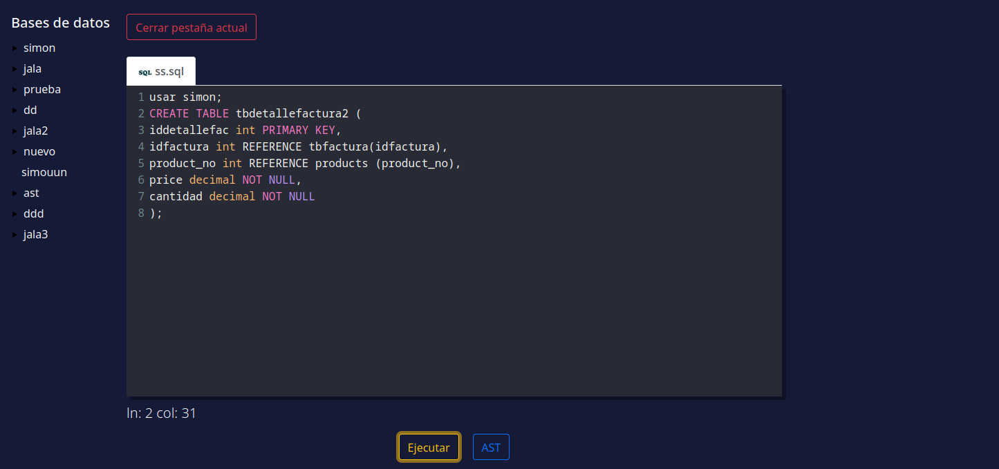
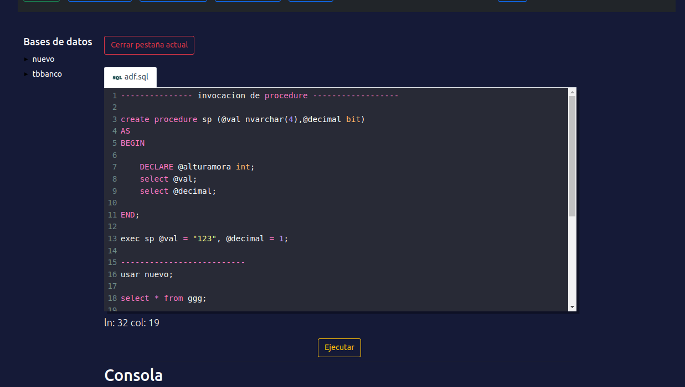
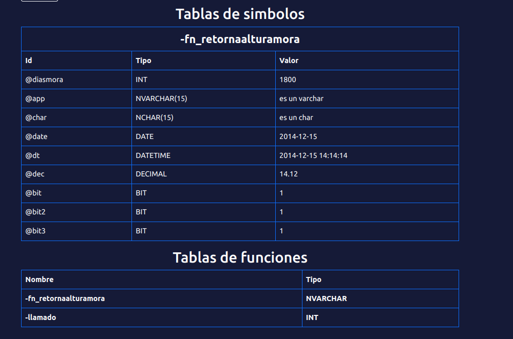

# Manual de Usuario
se puede visualizar un editor de texto en el cual se pueden realizar distintas funcionalidades.
* Crear: En este espacio se puede generar el archivo que desea el usuario
* seleccion de base de datos: el usario debera de ingresar la base de datos que quiere exportar.
* Crear Dump: se podra generar un dump en base a la base de datos ingresada.
* Exportar: el usario podra exportar todos los inserts de la base de datos
* Leer: El usuario podra cargar una base de datos al editor de codigo.
* Guardar Como: El usuario podra guardar el archivo en el que estaba trabajando.

# Guardar procedimiento

Al ejecutar una instrucciones de tipo procedimiento o funcion, si todo esta correcto se habilita la posibilidad de poder ver las tablas de simbolos de las funciones o procedimientos ejecutados.

Tabla de funciones almacenadas y tabla de simbolos por cada funcion ejecutada exitosamente