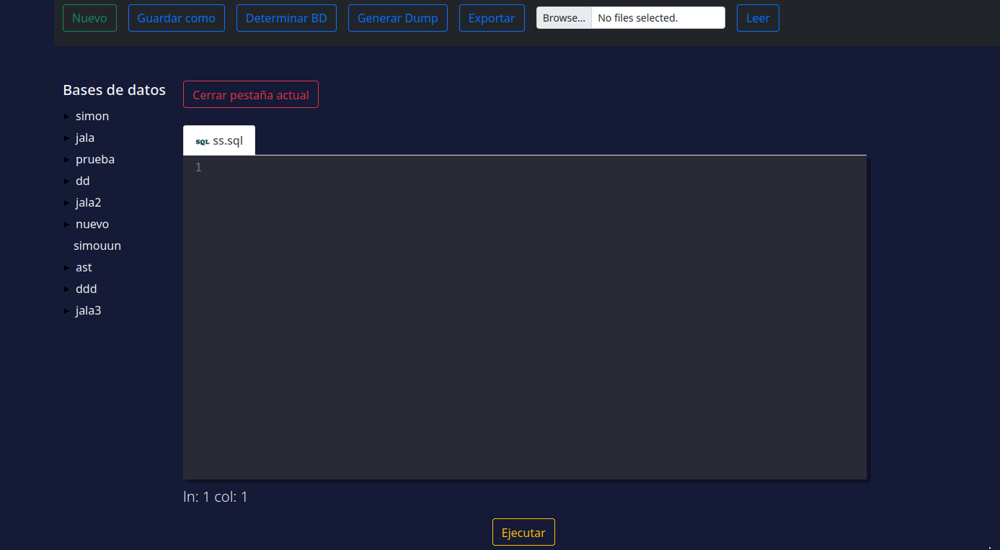
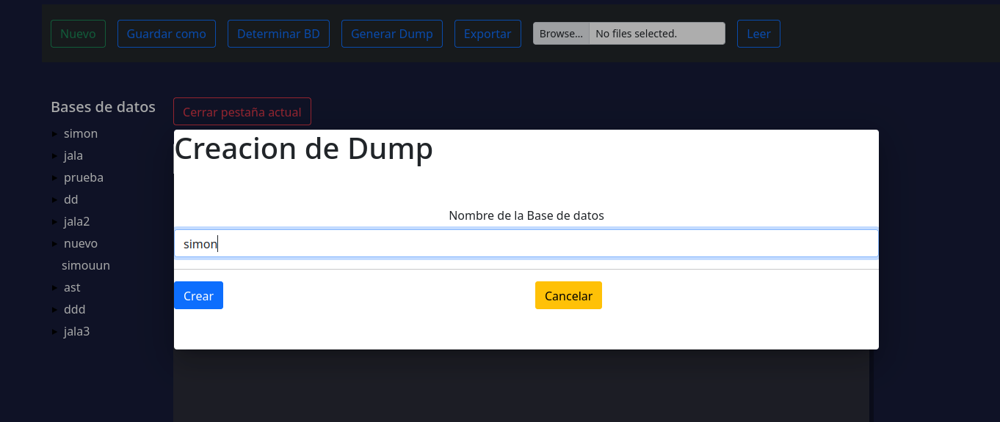
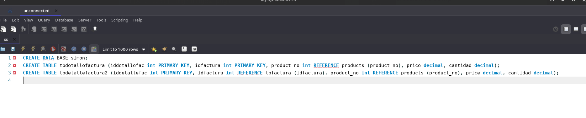
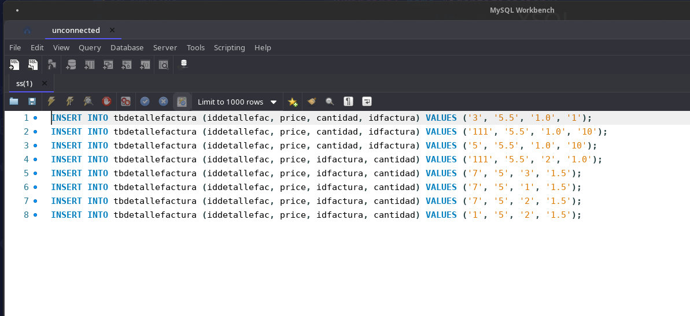
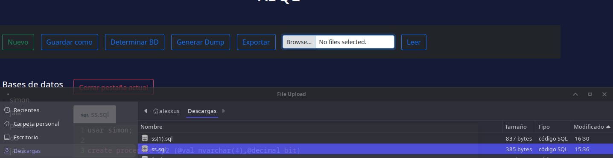

# Manual de Usuario
se puede visualizar un editor de texto en el cual se pueden realizar distintas funcionalidades.
* Crear: En este espacio se puede generar el archivo que desea el usuario
* seleccion de base de datos: el usario debera de ingresar la base de datos que quiere exportar.
* Crear Dump: se podra generar un dump en base a la base de datos ingresada.
* Exportar: el usario podra exportar todos los inserts de la base de datos
* Leer: El usuario podra cargar una base de datos al editor de codigo.
* Guardar Como: El usuario podra guardar el archivo en el que estaba trabajando.

Al momento de ejecutar se puede observar que la consola tiene cambios de colores en palabras reservadas y ademas en dado caso de errores, esta cuenta con una consola de salida de mensajes

Al momento de ejecutar la opcion de 'DeterminarDB', este mostrara en pantalla, un recuadro de texto, donde el usaurio ingresara que base de datos quiere, para exportar.

Ya con una base de datos seleccionada, podra utilziar el 'Generar Dump', el cual genera el dump de dicha base de datos

Ahora para el export, este boton al momento de ya haber seleccionado la base de dato, generara todos los inserts que tenga en el xml de la base de datos seleccionada:

El Leer, hace la funcion de insert, ya que cargara a partir de un archivo con estension sql, toda la informacion al editor de texto.
